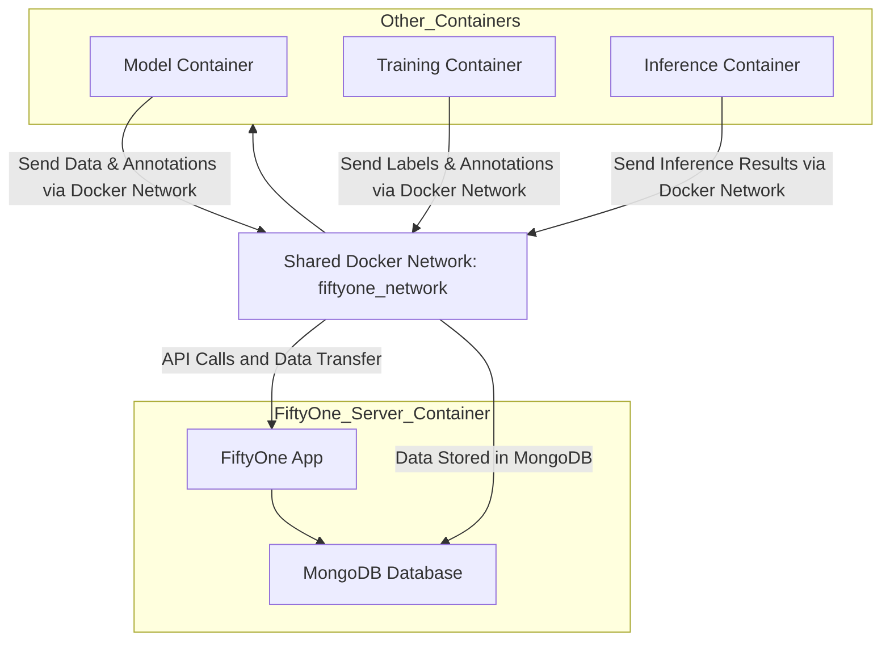

# FiftyOne Server 

## Diagram



## Setup

To run build the image

```
docker build -t fiftyone-server .
```

Create a network so that the containers can communicate with fiftyone-server

```
docker network create fiftyone_network
```

To run the container

```
docker run -d --name fiftyone -v /srv/datastore/fiftyone/:/fiftyone -v /srv/datastore/datasets_ML/:/srv/datastore/datasets_ML/ -p 5151:5151 -p 27017:27017 -it --network fiftyone_network fiftyone-server
```

To connect other containers to it we simply do the following (example for a container called bevfusion):

```
docker run --name bevfusion_container -v `pwd`:/workspace -v /srv/datastore:/srv/datastore --shm-size=16g -it --gpus all --network fiftyone_network -e FIFTYONE_DATABASE_URI=mongodb://fiftyone_server:27017 bevfusion:last
```

